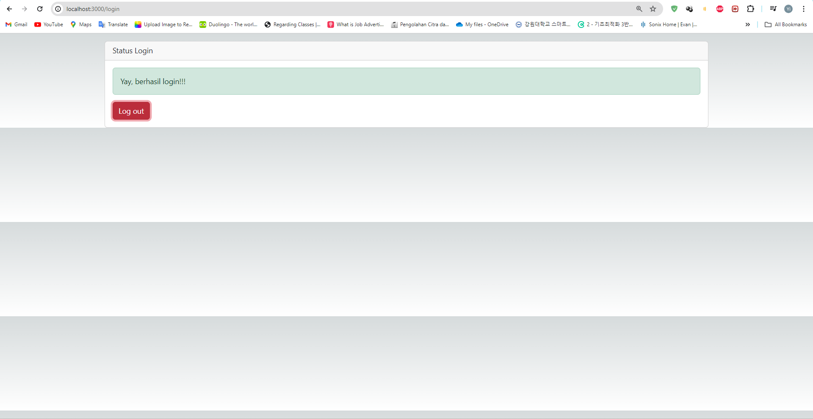

## Laporan Praktikum

|  | Pemrograman Berbasis Framework 2024 |
|--|--|
| NIM |  2141720167|
| Nama |  Evan Fadhilah Dzulfikar |
| Kelas | TI - 3I |

### Practicum 1

"Let's run our next.js project, and report what happens?"

    We can install bootstrap to our next.js project and use the template or resource from bootstrap. In this example is Popup.

 

### Practicum 2

## Question
"1. Try accessing http://localhost:3000/login, and click the login button. Then refresh the page many times (if necessary restart the npm run dev). Conclude what happens?"

    In this practicum, we implement the store method that we can use login and logout feature.

"2. Lines 25 and 30 have a parse() method, what happens if we don't use that method?"

    To give text output that we can divide into 2 parameters, login and logout... in default it is start from logout state.. then when we click button it is change to login state... We can give two different kind of text output this way!

 

