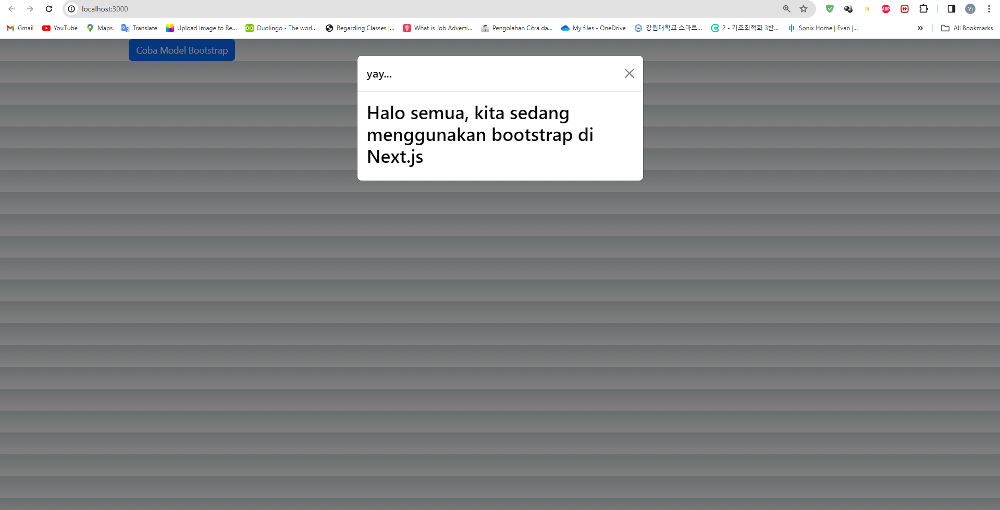

## Laporan Praktikum

|  | Pemrograman Berbasis Framework 2024 |
|--|--|
| NIM |  2141720167|
| Nama |  Evan Fadhilah Dzulfikar |
| Kelas | TI - 3I |

### Practicum 1

"Let's run our next.js project, and report what happens?"

    We can install bootstrap to our next.js project and use the template or resource from bootstrap. In this example is Popup.

 

### Practicum 2

## Question
"1. Try accessing http://localhost:3000/login, and click the login button. Then refresh the page many times (if necessary restart the npm run dev). Conclude what happens?"

    In this practicum, we implement the store method that we can use login and logout feature.

"2. Lines 25 and 30 have a parse() method, what happens if we don't use that method?"

    To give text output that we can divide into 2 parameters, login and logout... in default it is start from logout state.. then when we click button it is change to login state... We can give two different kind of text output this way!

 

### Practicum 3

"Let's run our next.js project, and see what happens?"

 

### Assignment (Practicum Questions)

"1. What does this code import { useEffect } from "react"; do in the pages/_app.tsx file? explain"

    It is used to set desired global effects, such as managing global data subscriptions, setting layout changes, or performing certain actions each time the app is reloaded.
 

"2. If in the pages/_app.tsx file we don't use useEffect (delete line 3, and lines 9-11, what will happen?"

    Line 3      : Deleting the useEffect import will cause the code that uses the useEffect to not run, as the useEffect is no longer imported into the file.
    Line 9-11   : Then Bootstrap may not load, and if the application some functionality of bootstrap may not work properly.
 

"3. Why in react/nextjs the html tag for class must be changed to className?"

    Since class is a keyword in JavaScript, className is used to assign CSS classes to elements in JSX to match valid JavaScript syntax.
 

"4. Can the store in nextjs store many redux reducers?"

    Yes, we can .... Redux is typically used to manage application state globally, including storing multiple reducers that manage specific parts of the application state.
 

"5. Explain the use of the store.js file!"

    The store.js file is commonly used to organize a Redux store in an application. It typically includes creating the Redux store, connecting middleware if needed, and combining reducers into one root reducer to be stored in the store.
 

"6. In the pages/login.tsx file, what does this code mean?
    const { isLogin } = useSelector((state) => state.auth);"

    This function is used to determine whether the user is logged in or not.
    This code uses Redux's useSelector hook to retrieve a part of the state stored in the Redux store, in this case the auth section. It extracts the isLogin value from the auth section of the Redux state and stores it in the isLogin variable. 
 

"7. In the pages/counter.tsx file, what does this code mean?
    const { totalCounter } = useSelector((state) => state.counter);"

    This function is used to display the total number of counts in the counter component.
    This code also uses Redux's useSelector hook to retrieve the totalCounter value from the counter section of the Redux state and store it in the totalCounter variable. 
 